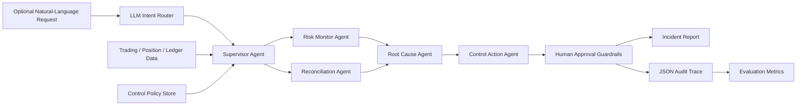

# Agentic Trading Risk Control Copilot

An auditable AI-agent-style workflow for trading risk monitoring, reconciliation, and control-gap investigation.

This project is designed for AI Engineer, data, algo, and risk roles where the useful work is not a generic chatbot, but an agentic system that can inspect structured workflows, call tools, generate evidence-backed findings, enforce guardrails, and leave an audit trail.

## What It Does

The copilot ingests synthetic trading operations data:

- executed trades
- marked positions and risk limits
- venue settlement ledger
- internal control policies
- labeled expected findings for evaluation

It can run either a deterministic full scan or an LLM-routed, scoped workflow:



The output is:

- a Markdown incident report for human reviewers
- a JSON audit trace of every tool call
- precision / recall / F1 against labeled expected incidents
- an action queue that blocks market-impacting actions behind human approval

## Why This Project Exists

Trading and risk teams increasingly need agentic systems that can support operational workflows without silently taking unsafe actions. This project focuses on the engineering pattern behind that:

- specialist agents rather than one monolithic assistant
- tool-calling over structured data
- policy-grounded reasoning
- human-in-the-loop guardrails
- reproducible evaluation
- auditability for risk and compliance contexts

The core implementation is standard-library Python and deterministic by design, so the default full scan runs without API keys. An optional LLM intent router can classify a natural-language request and select the relevant checks, while all calculations, action guardrails, and reporting remain deterministic and testable.

## Agents

| Agent | Role |
|---|---|
| `LLM Intent Router` | Converts a natural-language request into a validated intent, symbol scope, and requested action. |
| `RiskMonitorAgent` | Detects single-trade notional breaches, inventory limit breaches, and fee-bps outliers. |
| `ReconciliationAgent` | Detects venue settlement and internal ledger breaks. |
| `RootCauseAgent` | Maps findings to likely operational root causes. |
| `ControlActionAgent` | Converts findings into proposed operational actions. |
| `SupervisorAgent` | Orchestrates the workflow and records metrics/tool traces. |

## Controls Covered

| Control | Example Detection |
|---|---|
| Single-trade notional threshold | RFQ hedge trade exceeds pre-trade review limit. |
| Inventory limit | Marked ETH perpetual exposure exceeds symbol-level limit. |
| Reconciliation break | Venue settled quantity differs from internal expected quantity. |
| Fee-bps outlier | Execution fee deviates from expected maker/taker economics. |

## Quick Start

```bash
python3 -m pip install -e .
python3 -m agentic_trading_risk_copilot.cli --data data/sample --out reports
```

Expected console output:

```text
findings=4
approval_required=2
evaluation=precision:1.0000 recall:1.0000 f1:1.0000
wrote=reports/incident_report.md
wrote=reports/audit_trace.json
```

Run tests:

```bash
python3 -m unittest discover -s tests -p "test_*.py"
```

## Optional LLM Intent Router

The default command still runs every deterministic check. The recommended demo provider is Groq's OpenAI-compatible API with `openai/gpt-oss-20b`. Configure it with a newly created key; the prompt hides the key from terminal output and shell history:

```bash
make configure-llm
make check-llm
```

This creates a local `.env` with owner-only file permissions. `.env` is ignored by Git, while `.env.example` contains only safe defaults. Shell environment variables take precedence over values in `.env`.

Never paste a key into chat, source code, README files, screenshots, or commits. If a key is exposed, revoke it at the provider immediately and create a replacement.

Then run a scoped request:

```bash
make llm-demo
```

The router can select one of these allow-listed intents:

- `full_risk_scan`
- `trade_risk_review`
- `trade_notional_review`
- `inventory_risk_review`
- `reconciliation_review`
- `fee_anomaly_review`

The LLM never performs the numerical checks and never executes a trade. It only returns structured routing JSON; the application validates the intent and then calls deterministic tools. Requests to execute a market-impacting action remain recommendations behind the existing human-approval guardrails.

## Sample Output

The sample dataset intentionally includes four labeled control findings:

- a large ETH-PERP trade that breaches the single-trade notional threshold
- an ETH-PERP inventory exposure breach
- a SOL-PERP venue settlement break
- a SOL-PERP fee-bps outlier

The copilot turns those findings into operational actions. Market-impacting actions such as quote-size changes or hedge reviews are marked as `awaiting_human_approval`; lower-risk operations actions are queued as `ready_for_ops_queue`.

## Project Structure

```text
.
├── data/sample/
│   ├── control_policy.json
│   ├── expected_findings.json
│   ├── ledger.csv
│   ├── positions.csv
│   └── trades.csv
├── docs/
│   ├── interview_notes.md
│   └── resume_bullets.md
├── src/agentic_trading_risk_copilot/
│   ├── agents.py
│   ├── cli.py
│   ├── data_loader.py
│   ├── evaluation.py
│   ├── guardrails.py
│   ├── intent_router.py
│   ├── models.py
│   ├── reporting.py
│   └── tools.py
└── tests/
    └── test_copilot.py
```

## Design Choices

### Deterministic controls, bounded LLM routing

The detector and action workflow is deterministic because risk and control systems need reproducibility. The optional LLM is restricted to intent routing through a small allowlist. A production extension could add policy RAG, analyst Q&A, or report drafting, but detection, authorization, and high-impact actions should remain explicit.

### Guardrails are part of the product

The copilot does not trade, change limits, or pause strategies directly. It proposes actions and marks market-impacting steps for human approval.

### Evaluation is built in

The sample dataset has expected findings. The CLI compares observed findings against those labels and reports precision, recall, and F1. This mirrors how agent workflows should be tested before being trusted in operational settings.

## Resume Bullet

Built an agentic trading-risk copilot that detects execution, inventory, fee, and reconciliation control gaps, generates audited root-cause reports, and enforces human approval for market-impacting actions.

More resume variants are in [`docs/resume_bullets.md`](docs/resume_bullets.md).

## Limitations

- Synthetic dataset, not live venue replay.
- Local JSON policy retrieval, not vector-database RAG yet.
- The optional live LLM only routes intents; it does not yet plan multi-step tasks or choose arbitrary tools.
- No persistent observe-act-replan loop or long-term memory.
- No trading execution or automatic risk-limit changes by design.

## Next Improvements

- Expose detectors through function schemas or MCP tools for validated dynamic tool selection.
- Add a bounded observe-act-replan loop with step, timeout, and cost limits.
- Add LLM-assisted report drafting and analyst Q&A with structured output.
- Add vector retrieval over control documents.
- Add FastAPI endpoints and a small dashboard.
- Add real exchange API ingestion or historical trading-log replay.
- Add OpenTelemetry-style spans for observability.
