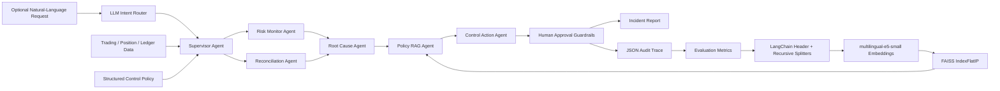

# Agentic Trading Risk Control Copilot

An auditable agentic workflow for trading risk monitoring, reconciliation, control-gap investigation, and policy-grounded RAG.

This project is designed for AI Engineer, data, algo, and risk roles where the useful work is not a generic chatbot, but an agentic system that can inspect structured workflows, call tools, generate evidence-backed findings, enforce guardrails, and leave an audit trail.

## What It Does

The copilot ingests synthetic trading operations data:

- executed trades
- marked positions and risk limits
- venue settlement ledger
- internal control policies
- labeled expected findings for evaluation

It can run either a deterministic full scan or an LLM-routed, scoped workflow. The V3 path adds a local multilingual embedding model, a FAISS index, grounded answer generation, citations, and retrieval evaluation:



The output is:

- a Markdown incident report for human reviewers
- a JSON audit trace of every tool call
- precision / recall / F1 against labeled expected incidents
- retrieved chunk IDs, similarity scores, and source metadata for grounded explanations
- Recall@K, Hit Rate@K, MRR, and metadata-filter abstention accuracy for the retrieval layer
- an action queue that blocks market-impacting actions behind human approval

## Why This Project Exists

Trading and risk teams increasingly need agentic systems that can support operational workflows without silently taking unsafe actions. This project focuses on the engineering pattern behind that:

- specialist agents rather than one monolithic assistant
- tool-calling over structured data
- policy-grounded reasoning
- human-in-the-loop guardrails
- reproducible evaluation
- auditability for risk and compliance contexts

The deterministic path uses standard-library Python and runs without API keys. The optional LLM classifies a request and drafts a grounded explanation, while calculations, thresholds, authorization, and action guardrails remain deterministic and testable. Knowledge documents are synthetic demo material and are never represented as real exchange policy.

## Agents

| Agent | Role |
|---|---|
| `LLM Intent Router` | Converts a natural-language request into a validated intent, symbol scope, and requested action. |
| `RiskMonitorAgent` | Detects single-trade notional breaches, inventory limit breaches, and fee-bps outliers. |
| `ReconciliationAgent` | Detects venue settlement and internal ledger breaks. |
| `RootCauseAgent` | Maps findings to likely operational root causes. |
| `PolicyRAGAgent` | Retrieves approved policy/runbook/incident chunks and generates a validated, cited explanation. |
| `ControlActionAgent` | Converts findings into proposed operational actions. |
| `SupervisorAgent` | Orchestrates the workflow and records metrics/tool traces. |

## Controls Covered

| Control | Example Detection |
|---|---|
| Single-trade notional threshold | RFQ hedge trade exceeds pre-trade review limit. |
| Inventory limit | Marked ETH perpetual exposure exceeds symbol-level limit. |
| Reconciliation break | Venue settled quantity differs from internal expected quantity. |
| Fee-bps outlier | Execution fee deviates from expected maker/taker economics. |

## Quick Start

```bash
python3 -m pip install -e .
python3 -m agentic_trading_risk_copilot.cli --data data/sample --out reports
```

Expected console output:

```text
findings=4
approval_required=2
evaluation=precision:1.0000 recall:1.0000 f1:1.0000
wrote=reports/incident_report.md
wrote=reports/audit_trace.json
```

Run tests:

```bash
python3 -m unittest discover -s tests -p "test_*.py"
```

## RAG Quick Start

Python 3.11 or 3.12 is recommended for the ML dependencies. With `uv`:

```bash
uv venv --python 3.12 .venv
uv pip install --python .venv/bin/python -e ".[rag]"
source .venv/bin/activate
make rag-index
make rag-eval
make rag-demo
```

`make rag-index` downloads `intfloat/multilingual-e5-small` on the first run, converts each chunk to a normalized 384-dimensional embedding, and builds an exact `faiss.IndexFlatIP` index. Because both query and passage vectors are normalized, inner product is equivalent to cosine similarity. Generated index artifacts under `data/rag_index/` are ignored by Git and can be rebuilt from source documents.

The indexing pipeline uses two LangChain splitters:

1. `MarkdownHeaderTextSplitter` keeps policy section boundaries and headings.
2. `RecursiveCharacterTextSplitter` splits only oversized sections with overlap.

At query time, the retriever applies `status`, `effective_from`, `jurisdiction`, and—when processing a finding—`risk_domain` filters. The model may cite only a chunk returned by retrieval; program-side validation rejects unknown citations.

The structured `data/sample/control_policy.json` is still the source of truth for executable thresholds. RAG text explains policy and procedures but cannot override a threshold, authorize a market-impacting action, or edit a ledger.

### Policy Q&A

The intent allowlist now also contains `policy_qa`. For example:

```bash
python -m agentic_trading_risk_copilot.cli \
  --rag \
  --request "Can the agent automatically hedge an inventory breach?"
```

The output either contains an answer backed by trusted `chunk_id` citations or an explicit `grounded=false` abstention when the retrieved excerpts do not answer the question. Similarity score is only a candidate-retrieval signal; it is not treated as proof that an answer exists.

### Retrieval Evaluation

The repository includes a 20-case bilingual JSONL benchmark under `data/rag_eval/evaluation.jsonl`, covering policy, runbook, historical-incident, and out-of-scope questions:

```bash
python -m agentic_trading_risk_copilot.rag_evaluation \
  --index data/rag_index \
  --benchmark data/rag_eval/evaluation.jsonl \
  --top-k 4
```

The evaluator writes per-case retrieval details to `reports/rag_evaluation.json` and reports Recall@K, Hit Rate@K, MRR, and metadata-filter abstention accuracy. The last metric covers unsupported labeled domains filtered by application metadata; it is not an end-to-end generation-abstention score. The benchmark is small and synthetic, so these scores demonstrate regression coverage rather than production quality.

## Optional LLM Intent Router

The default command still runs every deterministic check. The recommended demo provider is Groq's OpenAI-compatible API with `openai/gpt-oss-20b`. Configure it with a newly created key; the prompt hides the key from terminal output and shell history:

```bash
make configure-llm
make check-llm
```

This creates a local `.env` with owner-only file permissions. `.env` is ignored by Git, while `.env.example` contains only safe defaults. Shell environment variables take precedence over values in `.env`.

Never paste a key into chat, source code, README files, screenshots, or commits. If a key is exposed, revoke it at the provider immediately and create a replacement.

Then run a scoped request:

```bash
make llm-demo
```

The router can select one of these allow-listed intents:

- `full_risk_scan`
- `trade_risk_review`
- `trade_notional_review`
- `inventory_risk_review`
- `reconciliation_review`
- `fee_anomaly_review`
- `policy_qa`

The LLM never performs the numerical checks and never executes a trade. It only returns structured routing JSON; the application validates the intent and then calls deterministic tools. Requests to execute a market-impacting action remain recommendations behind the existing human-approval guardrails.

## Sample Output

The sample dataset intentionally includes four labeled control findings:

- a large ETH-PERP trade that breaches the single-trade notional threshold
- an ETH-PERP inventory exposure breach
- a SOL-PERP venue settlement break
- a SOL-PERP fee-bps outlier

The copilot turns those findings into operational actions. Market-impacting actions such as quote-size changes or hedge reviews are marked as `awaiting_human_approval`; lower-risk operations actions are queued as `ready_for_ops_queue`.

## Project Structure

```text
.
├── data/sample/
│   ├── control_policy.json
│   ├── expected_findings.json
│   ├── ledger.csv
│   ├── positions.csv
│   └── trades.csv
├── data/rag_eval/evaluation.jsonl
├── knowledge_base/
│   ├── policies/
│   ├── runbooks/
│   └── incidents/
├── docs/
│   ├── interview_notes.md
│   └── resume_bullets.md
├── src/agentic_trading_risk_copilot/
│   ├── agents.py
│   ├── cli.py
│   ├── data_loader.py
│   ├── evaluation.py
│   ├── guardrails.py
│   ├── intent_router.py
│   ├── models.py
│   ├── rag/
│   │   ├── agent.py
│   │   ├── embeddings.py
│   │   ├── index.py
│   │   ├── knowledge.py
│   │   └── schemas.py
│   ├── rag_evaluation.py
│   ├── reporting.py
│   └── tools.py
└── tests/
    └── test_copilot.py
```

## Design Choices

### Deterministic controls, bounded LLM reasoning

The detector and action workflow is deterministic because risk and control systems need reproducibility. The LLM is restricted to allowlisted intent routing and evidence-grounded explanations. Detection, authorization, and high-impact actions remain explicit application logic.

### RAG is evidence, not authority

Retrieved documents are treated as untrusted context. Metadata filters run before generation, historical incidents are labeled as analogies rather than proof, citations are checked against the retrieval set, and an empty retrieval result causes abstention. This keeps fluent model output outside the authorization boundary.

### Guardrails are part of the product

The copilot does not trade, change limits, or pause strategies directly. It proposes actions and marks market-impacting steps for human approval.

### Evaluation is built in

The sample dataset has expected findings. The CLI compares observed findings against those labels and reports precision, recall, and F1. This mirrors how agent workflows should be tested before being trusted in operational settings.

## Resume Bullet

Built an agentic trading-risk copilot that detects execution, inventory, fee, and reconciliation control gaps, generates audited root-cause reports, and enforces human approval for market-impacting actions.

More resume variants are in [`docs/resume_bullets.md`](docs/resume_bullets.md).

## Limitations

- Synthetic dataset, not live venue replay.
- Synthetic policies and a small curated benchmark, not internal Bitget documents or a production corpus.
- Local FAISS index rather than a distributed vector service such as Milvus, pgvector, or Weaviate.
- The optional live LLM routes intents and drafts cited explanations; it does not autonomously plan arbitrary multi-step tasks or choose unrestricted tools.
- No document-level ACL, tenant isolation, reranker, hybrid BM25+dense retrieval, or production feedback loop yet.
- No persistent observe-act-replan loop or long-term memory.
- No trading execution or automatic risk-limit changes by design.

## Next Improvements

- Expose detectors through function schemas or MCP tools for validated dynamic tool selection.
- Add a bounded observe-act-replan loop with step, timeout, and cost limits.
- Add hybrid retrieval and a cross-encoder reranker for a larger corpus.
- Add document-level ACL and tenant filtering before retrieval.
- Add feedback capture, hard-negative mining, and periodic benchmark refresh.
- Add FastAPI endpoints and a small dashboard.
- Add real exchange API ingestion or historical trading-log replay.
- Add OpenTelemetry-style spans for observability.
