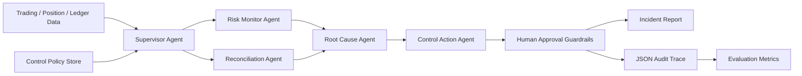

# Agentic Trading Risk Control Copilot

An auditable AI-agent-style workflow for trading risk monitoring, reconciliation, and control-gap investigation.

This project is designed for AI Engineer, data, algo, and risk roles where the useful work is not a generic chatbot, but an agentic system that can inspect structured workflows, call tools, generate evidence-backed findings, enforce guardrails, and leave an audit trail.

## What It Does

The copilot ingests synthetic trading operations data:

- executed trades
- marked positions and risk limits
- venue settlement ledger
- internal control policies
- labeled expected findings for evaluation

It then runs a deterministic multi-agent workflow:



The output is:

- a Markdown incident report for human reviewers
- a JSON audit trace of every tool call
- precision / recall / F1 against labeled expected incidents
- an action queue that blocks market-impacting actions behind human approval

## Why This Project Exists

Trading and risk teams increasingly need agentic systems that can support operational workflows without silently taking unsafe actions. This project focuses on the engineering pattern behind that:

- specialist agents rather than one monolithic assistant
- tool-calling over structured data
- policy-grounded reasoning
- human-in-the-loop guardrails
- reproducible evaluation
- auditability for risk and compliance contexts

The current implementation is standard-library Python and deterministic by design, so it can be cloned and run without API keys. It is LLM-ready, but the MVP keeps the reasoning path transparent and testable.

## Agents

| Agent | Role |
|---|---|
| `RiskMonitorAgent` | Detects single-trade notional breaches, inventory limit breaches, and fee-bps outliers. |
| `ReconciliationAgent` | Detects venue settlement and internal ledger breaks. |
| `RootCauseAgent` | Maps findings to likely operational root causes. |
| `ControlActionAgent` | Converts findings into proposed operational actions. |
| `SupervisorAgent` | Orchestrates the workflow and records metrics/tool traces. |

## Controls Covered

| Control | Example Detection |
|---|---|
| Single-trade notional threshold | RFQ hedge trade exceeds pre-trade review limit. |
| Inventory limit | Marked ETH perpetual exposure exceeds symbol-level limit. |
| Reconciliation break | Venue settled quantity differs from internal expected quantity. |
| Fee-bps outlier | Execution fee deviates from expected maker/taker economics. |

## Quick Start

```bash
python -m pip install -e .
python -m agentic_trading_risk_copilot.cli --data data/sample --out reports
```

Expected console output:

```text
findings=4
approval_required=2
evaluation=precision:1.0000 recall:1.0000 f1:1.0000
wrote=reports/incident_report.md
wrote=reports/audit_trace.json
```

Run tests:

```bash
python -m unittest discover -s tests -p "test_*.py"
```

## Sample Output

The sample dataset intentionally includes four labeled control findings:

- a large ETH-PERP trade that breaches the single-trade notional threshold
- an ETH-PERP inventory exposure breach
- a SOL-PERP venue settlement break
- a SOL-PERP fee-bps outlier

The copilot turns those findings into operational actions. Market-impacting actions such as quote-size changes or hedge reviews are marked as `awaiting_human_approval`; lower-risk operations actions are queued as `ready_for_ops_queue`.

## Project Structure

```text
.
├── data/sample/
│   ├── control_policy.json
│   ├── expected_findings.json
│   ├── ledger.csv
│   ├── positions.csv
│   └── trades.csv
├── docs/
│   ├── interview_notes.md
│   └── resume_bullets.md
├── src/agentic_trading_risk_copilot/
│   ├── agents.py
│   ├── cli.py
│   ├── data_loader.py
│   ├── evaluation.py
│   ├── guardrails.py
│   ├── models.py
│   ├── reporting.py
│   └── tools.py
└── tests/
    └── test_copilot.py
```

## Design Choices

### Deterministic first, LLM-ready second

The agent workflow is deterministic because risk and control systems need reproducibility. A production extension could add an LLM layer for analyst Q&A or report drafting, but the first version keeps detection, policy retrieval, action proposal, and evaluation explicit.

### Guardrails are part of the product

The copilot does not trade, change limits, or pause strategies directly. It proposes actions and marks market-impacting steps for human approval.

### Evaluation is built in

The sample dataset has expected findings. The CLI compares observed findings against those labels and reports precision, recall, and F1. This mirrors how agent workflows should be tested before being trusted in operational settings.

## Resume Bullet

Built an agentic trading-risk copilot that detects execution, inventory, fee, and reconciliation control gaps, generates audited root-cause reports, and enforces human approval for market-impacting actions.

More resume variants are in [`docs/resume_bullets.md`](docs/resume_bullets.md).

## Limitations

- Synthetic dataset, not live venue replay.
- Local JSON policy retrieval, not vector-database RAG yet.
- Deterministic agents, not live LLM calls.
- No trading execution or automatic risk-limit changes by design.

## Next Improvements

- Add optional LLM adapter for report drafting and analyst Q&A.
- Add vector retrieval over control documents.
- Add FastAPI endpoints and a small dashboard.
- Add real exchange API ingestion or historical trading-log replay.
- Add OpenTelemetry-style spans for observability.
