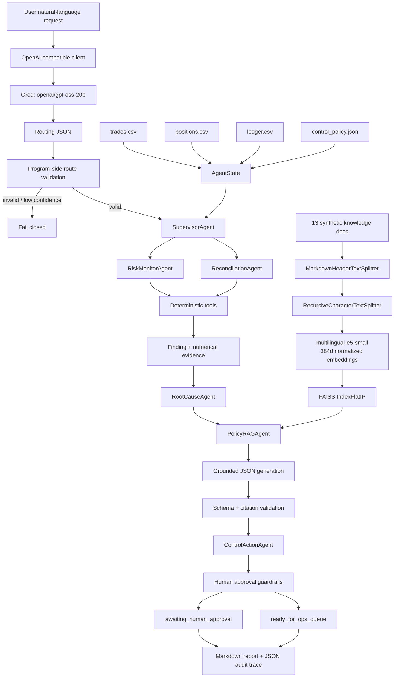

# 项目深挖：Agentic Trading Risk Control Copilot V3（RAG 版本）

> 用途：Bitget 算法工程师 / AI Agent / RAG / 风控方向面试准备。
>
> 真实性声明：项目中的交易、仓位、ledger、policy、runbook 和 historical incident 全部是 synthetic demo data，不代表 Bitget 或任何真实交易所的内部数据与政策。

---

# 0. 面试前必须记住的结论

## 0.1 一句话介绍

我构建了一个面向交易风险运营的 **bounded agentic copilot**：它使用 LLM 将自然语言请求转换为经过严格校验的风险意图，由 Supervisor 编排确定性的交易、库存、手续费和清算对账工具；随后通过基于 LangChain、multilingual E5 和 FAISS 的 Policy RAG，从政策、调查手册和历史事件中检索证据，生成带可验证引用的解释与调查建议，并把所有可能影响市场、仓位或限额的动作拦截在人工审批之前。

## 0.2 30 秒版本

> 这是一个交易风险控制 Copilot。用户可以直接提出“检查 ETH-PERP 库存风险并解释适用政策”。Groq 上的 `openai/gpt-oss-20b` 先把自然语言转换为经过程序校验的 JSON intent，Supervisor 再调用确定性工具检查 trade notional、inventory exposure、fee anomaly 和 reconciliation break。V3 新增 Policy RAG：我用 LangChain 做 Markdown-aware chunking，用 `multilingual-e5-small` 生成 384 维向量，并用 FAISS `IndexFlatIP` 检索 policy、runbook 和相似事件。LLM 只能基于检索内容生成结构化答案，引用 ID 会被程序验证；交易、对冲和改限额仍然必须人工审批。系统最终输出 Markdown report、JSON audit trace，以及 detection 和 retrieval 两层离线评测。

## 0.3 90 秒版本

> 我做这个项目的出发点是：交易风控不是普通问答，而是从理解业务请求、检查结构化数据、解释政策、提出动作，到审批和审计的一整套 workflow。
>
> 系统输入包括 trades、positions、settlement ledger 和结构化 control policy。用户请求先经过 LLM Intent Router，输出 `intent`、`symbol`、`requested_action`、`confidence` 和 `rationale`。程序会检查 exact keys、枚举、置信度范围和 symbol regex；不合法或低置信度请求 fail closed。之后 Supervisor 只调用必要的专业 Agent 和 deterministic tools，风险金额与阈值判断不交给 LLM。
>
> V3 加入了一个独立的 PolicyRAGAgent。我生成了 13 份 synthetic policy、runbook 和 incident 文档，使用 LangChain 的 `MarkdownHeaderTextSplitter` 与 `RecursiveCharacterTextSplitter` 切成 62 个 chunks，再用本地 `intfloat/multilingual-e5-small` 生成 normalized 384-dimensional embeddings，存入 FAISS `IndexFlatIP`。对于每个 finding，系统按 risk domain、status、effective date 和 jurisdiction 检索相关条款，并要求 LLM 返回固定 JSON，包括 `grounded`、answer、hypotheses、next steps 和 citation IDs。程序只从实际 retrieval set 回填 citation metadata，模型伪造引用就拒绝输出；证据不足时返回 `grounded=false`。
>
> 在 synthetic fixture 上，确定性扫描找出 4 个预置风险事件，Precision、Recall、F1 都为 1.0。RAG 的 20 条中英双语 retrieval benchmark 得到 Recall@4=1.0、Hit Rate@4=1.0、MRR=0.8958、metadata-filter abstention accuracy=1.0。我要强调这些数字只是小型 regression benchmark，不代表生产泛化性能。

## 0.4 V2 到 V3 到底增加了什么

| 维度 | V2 | V3 |
|---|---|---|
| 自然语言入口 | LLM Intent Router | 保留 |
| 风险检测 | Deterministic tools | 保留 |
| 政策来源 | `control_policy.json` | Structured policy + RAG knowledge base |
| 非结构化知识 | 无 | Policy / runbook / incident |
| Chunking | 无 | LangChain header + recursive splitting |
| Embedding | 无 | `intfloat/multilingual-e5-small` |
| Vector DB | 无 | FAISS `IndexFlatIP` |
| 解释生成 | 固定 root-cause mapping | Policy-grounded LLM explanation |
| 引用 | 无 | Verified `chunk_id` citations |
| 拒答 | Router fail closed | Router fail closed + RAG `grounded=false` |
| 知识问答 | 不支持 | 新增 `policy_qa` intent |
| RAG 评测 | 无 | Recall@K / Hit Rate@K / MRR / metadata-filter abstention |

## 0.5 最准确的项目定位

可以称为：

- `bounded agentic workflow`
- `LLM-routed risk-control copilot`
- `policy-grounded RAG system`
- `multi-agent-style orchestration`
- `human-in-the-loop decision-support system`
- `auditable AI application MVP`

不要称为：

- 已经上线的 Bitget 内部系统
- 完全自主的 trading agent
- 自动下单或自动对冲机器人
- 使用 LangGraph 构建的系统
- 使用 LangChain Agent 的系统
- 使用 Milvus、pgvector 或 Weaviate 的系统
- 已经经过真实生产流量验证的风控模型
- 使用 LoRA、DPO、RL 或 GNN 的项目

最诚实的边界是：

> 当前项目使用 LangChain 的 text splitters，但 orchestration 是普通 Python 显式编排，vector index 是直接调用 FAISS，LLM 负责 routing 和 grounded explanation。它没有开放式 observe-plan-act-replan loop，也没有让模型自由选择任意工具；在风控场景中，这是为了 bounded capability、可审计性和 fail-closed behavior。

---

# 1. 项目解决的业务问题

## 1.1 为什么普通风险脚本不够

传统风险脚本通常有四个割裂：

1. **入口割裂**：业务人员需要知道脚本、参数、表名和字段，不能直接描述问题。
2. **检测割裂**：交易、仓位、费用、清算对账由不同逻辑处理，缺少统一 workflow。
3. **知识割裂**：报警规则、政策解释、调查步骤和历史事件分散，analyst 需要手工搜索。
4. **行动割裂**：发现问题后缺少统一 finding schema、action queue、approval boundary 和 audit trace。

这个项目把它们串成：

```text
Natural-language request
        ↓
Validated intent and scope
        ↓
Deterministic risk tools
        ↓
Evidence-backed finding
        ↓
Policy / runbook / incident retrieval
        ↓
Grounded explanation with citations
        ↓
Proposed action
        ↓
Human approval boundary
        ↓
Report + audit trace + evaluation
```

## 1.2 目标用户是谁

- Risk analyst
- Trading operations
- Reconciliation operations
- Market-risk desk
- Execution-quality analyst
- Compliance / AI governance reviewer

它不是给普通用户推荐买卖方向，而是帮助内部 analyst 更快完成：

- “发生了什么？”
- “哪个 control 被触发？”
- “计算证据是什么？”
- “相关政策和 runbook 在哪里？”
- “哪些原因值得调查？”
- “下一步可以做什么？”
- “这个动作需要谁批准？”
- “事后如何 replay？”

## 1.3 为什么需要 RAG

确定性 detector 能回答“是否超限”，但不能完整回答：

- 为什么这个 control 存在？
- 需要收集哪些 evidence？
- 如何排除 data-quality problem？
- 该进入什么 escalation path？
- 有没有相似历史 failure mode？
- 怎样关闭 incident？

把全部文档塞进 prompt 会带来 context cost、噪声和引用困难。RAG 的作用是先从受控语料里找出最相关的小段 evidence，再让 LLM 基于 evidence 组织答案。

## 1.4 为什么是 Copilot，不是 Trading Bot

Trading Bot 通常负责：

- 预测 alpha；
- 产生 buy/sell signal；
- sizing；
- execution；
- 连接 exchange API 下单。

本项目负责：

- 检查风险状态；
- 解释 control；
- 检索调查知识；
- 提出 operational recommendation；
- 记录 evidence 和 citation；
- 要求人工审批。

它不预测收益，也不自动交易。**模型能生成一个 action proposal，不等于模型有权执行这个 action。**

---

# 2. 系统整体架构

## 2.1 Mermaid 技术流程图



## 2.2 纯文本流程图

```text
┌──────────────────────────────────────┐
│ User natural-language request        │
└──────────────────┬───────────────────┘
                   ▼
┌──────────────────────────────────────┐
│ LLM Intent Router                    │
│ gpt-oss-20b via Groq                 │
│ Output: constrained JSON             │
└──────────────────┬───────────────────┘
                   ▼
┌──────────────────────────────────────┐
│ Program-side validation              │
│ exact keys / enum / regex / range /  │
│ confidence >= 0.60                   │
└──────────────┬───────────────────────┘
               │ valid                  invalid
               ▼                        ─────────► fail closed
┌──────────────────────────────────────┐
│ SupervisorAgent                      │
│ intent → selected agents/checks      │
└──────────────┬───────────────┬───────┘
               ▼               ▼
┌─────────────────────┐  ┌──────────────────────┐
│ RiskMonitorAgent    │  │ ReconciliationAgent  │
└──────────────┬──────┘  └──────────┬───────────┘
               └──────────┬─────────┘
                          ▼
┌──────────────────────────────────────┐
│ Deterministic risk tools             │
│ notional / inventory / fee / recon   │
└──────────────────┬───────────────────┘
                   ▼
┌──────────────────────────────────────┐
│ Finding + evidence + policy rule ID  │
└──────────────────┬───────────────────┘
                   ▼
┌──────────────────────────────────────┐
│ RootCauseAgent                      │
│ initial operational hypothesis       │
└──────────────────┬───────────────────┘
                   ▼
┌──────────────────────────────────────┐
│ PolicyRAGAgent                       │
│ query → E5 → FAISS → filters → top K │
└──────────────────┬───────────────────┘
                   ▼
┌──────────────────────────────────────┐
│ LLM grounded JSON                    │
│ answer / hypotheses / steps / cites  │
└──────────────────┬───────────────────┘
                   ▼
┌──────────────────────────────────────┐
│ Program validation                   │
│ citation must belong to retrieval set│
└──────────────────┬───────────────────┘
                   ▼
┌──────────────────────────────────────┐
│ ControlActionAgent + Guardrails      │
└──────────────┬───────────────┬───────┘
               ▼               ▼
       human approval       ops queue
               └──────────┬────┘
                          ▼
                 Report + Audit + Eval
```

## 2.3 两条数据路径

系统里有两条必须分开的路径。

### 路径 A：控制决策路径

```text
structured data
→ structured policy threshold
→ deterministic calculation
→ finding
→ action policy
→ approval guardrail
```

这条路径决定是否报警、报警等级和动作权限，要求可复现。

### 路径 B：知识解释路径

```text
finding or policy question
→ embedding retrieval
→ policy/runbook/incident chunks
→ grounded LLM explanation
→ verified citations
```

这条路径帮助人理解和调查，但不获得执行权。

## 2.4 为什么必须分成两条路径

如果直接让 LLM 从自然语言 policy 里临时读取 `$250,000`，再决定一笔交易是否违规，会有以下风险：

- 召回到旧版本政策；
- 召回错误 jurisdiction；
- 数字抽取错误；
- prompt injection 改写规则；
- 输出不可重复；
- policy 文档更新后行为悄悄漂移；
- 无法证明执行时使用了哪个 threshold snapshot。

因此数字阈值属于 structured policy service；RAG 文档负责 rationale、procedure 和 citation。

---

# 3. 数据层与共享状态

## 3.1 结构化业务数据

| 文件 | 数量 | 关键字段 | 用途 |
|---|---:|---|---|
| `trades.csv` | 6 | trade_id、venue、symbol、side、quantity、price、fee、order_type、strategy | notional、fee checks |
| `positions.csv` | 3 | symbol、quantity、mark_price、limit_quantity、limit_notional | inventory check |
| `ledger.csv` | 6 | expected_quantity、settled_quantity、status、reason | reconciliation check |
| `control_policy.json` | 4 rules | threshold、unit、severity、action_type | executable control source |
| `expected_findings.json` | 4 labels | expected finding IDs | detection regression evaluation |

## 3.2 非结构化 RAG 知识库

当前一共 13 份文档：

| 类型 | 数量 | 例子 | 作用 |
|---|---:|---|---|
| Policy | 5 | Inventory Risk Policy、Settlement Reconciliation Policy | 解释控制目标、定义、边界 |
| Runbook | 4 | Manual Hedge Review、Fee Anomaly Investigation | 提供调查步骤和 closure criteria |
| Incident | 4 | Delayed Hedge Fill、Incorrect Fee Tier | 提供相似 failure mode，不作为因果证明 |

覆盖的 `risk_domain`：

- `inventory_limit`
- `single_trade_notional`
- `fee_bps_outlier`
- `reconciliation_break`
- `ai_governance`

## 3.3 文档 metadata schema

每份文档使用 YAML-like frontmatter：

```yaml
---
document_id: POL-INV-001
document_type: policy
title: Marked Inventory Exposure Control
risk_domain: inventory_limit
version: 2.1
effective_from: 2026-01-01
status: active
jurisdiction: global
owner: market-risk
synthetic: true
---
```

这些 metadata 不只是展示字段，而是 retrieval control 的一部分：

- `document_id`：稳定引用和审计；
- `document_type`：区分 policy、runbook、incident；
- `risk_domain`：finding 级范围过滤；
- `version`：记录依据版本；
- `effective_from`：排除尚未生效的文档；
- `status`：排除 inactive 文档；
- `jurisdiction`：控制适用区域；
- `owner`：明确维护责任；
- `synthetic`：避免把 demo 文档伪装为真实政策。

## 3.4 Typed domain models

核心对象使用 Python `dataclass`：

- `Trade`
- `Position`
- `LedgerEntry`
- `PolicyRule`
- `Finding`
- `Citation`
- `GroundedAnalysis`
- `Action`
- `ToolCall`
- `RoutingDecision`
- `AgentState`

V3 中 `Finding` 新增：

```python
rag_analysis: GroundedAnalysis | None
```

`GroundedAnalysis` 包含：

```python
answer: str
grounded: bool
root_cause_hypotheses: list[str]
recommended_next_steps: list[str]
citations: list[Citation]
```

## 3.5 AgentState 是什么

`AgentState` 是 workflow 的共享状态：

```text
AgentState
├── raw data
│   ├── trades
│   ├── positions
│   ├── ledger
│   └── policies
├── request context
│   ├── user_request
│   └── routing_decision
├── workflow outputs
│   ├── findings
│   ├── knowledge_answer
│   ├── actions
│   ├── metrics
│   └── tool_trace
```

每个 Agent 接收同一 state，读取所需数据，并写回自己的结果。

优点：

- 接口明确；
- 便于审计状态变化；
- 易于 unit test；
- 适合单进程 MVP。

限制：

- 没有 persistent checkpoint；
- 进程失败后不能 resume；
- 没有并发状态控制；
- 没有 event sourcing；
- 暂未使用 LangGraph state/checkpointer。

## 3.6 Tool trace

每一步都能记录：

```json
{
  "tool_name": "policy-rag-agent.retrieval",
  "inputs": {
    "target": "F-INV-ETH-PERP",
    "query": "...",
    "top_k": 4,
    "filters": {
      "risk_domain": "inventory_limit",
      "status": "active",
      "jurisdiction": "global"
    },
    "min_score": 0.70
  },
  "outputs": {
    "results": [
      {
        "chunk_id": "POL-INV-001:004",
        "document_id": "POL-INV-001",
        "score": 0.88
      }
    ]
  }
}
```

它是 auditability 的最小实现，但还不是 tamper-proof audit log。生产中还需增加 trace ID、timestamp、latency、actor、model/prompt/index version、data snapshot 和 immutable storage。

---

# 4. Intent Router

## 4.1 当前允许的七种 intent

```text
full_risk_scan
trade_risk_review
trade_notional_review
inventory_risk_review
reconciliation_review
fee_anomaly_review
policy_qa
```

另外有 `unsupported`，但它不会进入正常 workflow；程序会 fail closed。

## 4.2 Router 输出格式

```json
{
  "intent": "inventory_risk_review",
  "symbol": "ETH-PERP",
  "requested_action": "recommend",
  "confidence": 0.96,
  "rationale": "The user requested an ETH inventory review."
}
```

## 4.3 程序侧 validation

程序检查：

1. 输出必须是 JSON object；
2. keys 必须完全等于预定义集合；
3. intent 必须来自 `RiskIntent` enum；
4. `requested_action` 只能是 `analyze/recommend/execute`；
5. confidence 必须处于 `[0,1]`；
6. confidence 必须至少为 `0.60`；
7. symbol 必须通过 uppercase regex；
8. rationale 不能为空；
9. `unsupported` 必须拒绝。

## 4.4 为什么用户语言千变万化仍能分类

分类工作由 LLM 的 semantic understanding 完成，不是通过 Python 写出所有关键词组合。Prompt 给模型：

- allowlisted intents；
- 每个 intent 的业务定义；
- JSON schema；
- symbol/action 抽取规则；
- prompt-injection 防护说明。

Python 负责的不是“理解所有自然语言”，而是验证模型输出是否属于允许的状态空间。

## 4.5 Router 为什么不能直接调用交易工具

Router 只负责语义映射。即使用户说“立即卖出 ETH 降低风险”，Router 也只会输出：

```json
{
  "requested_action": "execute"
}
```

后续系统仍只产生 proposal，guardrail 会要求 human approval。用户文本和模型输出都不能自己扩大权限。

---

# 5. Supervisor 与专业 Agent

## 5.1 Supervisor 路由表

| Intent | RiskMonitor checks | ReconciliationAgent | PolicyRAGAgent |
|---|---|---:|---:|
| `full_risk_scan` | trade + inventory + fee | 是 | 若启用 RAG，对所有 findings 运行 |
| `trade_risk_review` | trade + inventory + fee | 否 | 对相关 findings 运行 |
| `trade_notional_review` | trade | 否 | 对 trade findings 运行 |
| `inventory_risk_review` | inventory | 否 | 对 inventory findings 运行 |
| `fee_anomaly_review` | fee | 否 | 对 fee findings 运行 |
| `reconciliation_review` | 无 | 是 | 对 recon findings 运行 |
| `policy_qa` | 无 | 否 | 直接回答知识问题 |

## 5.2 为什么称为 multi-agent-style

组件有明确 role boundary：

- `RiskMonitorAgent`：交易、库存、费用；
- `ReconciliationAgent`：settlement/accounting reconciliation；
- `RootCauseAgent`：生成初始 operational hypothesis；
- `PolicyRAGAgent`：检索知识并生成 cited analysis；
- `ControlActionAgent`：生成 action proposal；
- `SupervisorAgent`：决定调用顺序。

但它们不是多个自由对话的 LLM，也没有 negotiation、自主 planning 或无限循环，所以更准确叫 `multi-agent-style orchestration`。

## 5.3 为什么没有用 LangGraph

当前 workflow 是固定 DAG，使用普通 Python 显式编排更简单、可预测，也更容易解释：

```text
route
→ specialist detectors
→ root cause
→ RAG
→ proposed actions
→ guardrails
→ report
```

如果以后出现以下需求，LangGraph 才更有价值：

- pause/resume；
- human interrupt；
- checkpoint；
- conditional loop；
- retry/re-plan；
- parallel evidence collection；
- long-running investigation。

---

# 6. 四类确定性风险检查

## 6.1 Single-trade notional

公式：

```text
trade_notional = quantity × price
```

样例 `T-1005`：

```text
quantity = 180 ETH
price = 3,550 USD
notional = 180 × 3,550 = 639,000 USD
threshold = 250,000 USD
```

因此：

```text
F-TRADE-T-1005
severity = HIGH
action = quote_size_reduction
status = awaiting_human_approval
```

为什么最终仓位没有超限也可能触发？

因为 single-trade control 关注的是单次 execution 的 market impact、slippage、fat-finger 和 mandate risk；inventory control 关注的是交易后的累计仓位风险。两者不是同一个问题。

## 6.2 Inventory exposure

公式：

```text
inventory_notional = abs(quantity × mark_price)
utilization = inventory_notional / limit_notional
```

ETH-PERP 样例：

```text
quantity = 2,180
mark_price = 3,545 USD
inventory_notional = 7,728,100 USD
limit_notional = 7,000,000 USD
utilization = 110.4%
```

因此：

```text
F-INV-ETH-PERP
severity = CRITICAL
action = manual_hedge_review
status = awaiting_human_approval
```

为什么用绝对值？

因为 long 和 short 都会产生单 symbol gross exposure。但 production 还必须保留 signed exposure，用于方向、netting、basis risk 和 hedge sizing。

## 6.3 Fee anomaly

单笔 fee bps：

```text
fee_bps = fee / abs(trade_notional) × 10,000
```

动态 cutoff：

```text
cutoff = max(static_threshold, mean(all_fee_bps) + 2 × population_sigma)
```

当前样例：

```text
static threshold = 4.5 bps
baseline mean = 4.2417 bps
dynamic cutoff = 8.2798 bps
T-1003 fee = 8.45 bps
```

因此 `T-1003` 触发 fee anomaly。

这个 baseline 的限制：

- 样本极小；
- outlier 参与了 mean/std 计算；
- 未按 venue、VIP tier、maker/taker 分组；
- mean/std 对 heavy-tail 不稳健；
- 没有 time-based rolling window。

Production 可以使用 fee schedule comparison、median + MAD、quantile 或 peer-group model。

## 6.4 Reconciliation break

定义：

```text
expected_quantity = internal order/fill ledger 预计结算数量
settled_quantity = venue/settlement ledger 已确认并记账数量
break_quantity = settled_quantity - expected_quantity
```

`T-1003` 样例：

```text
expected = 1,250 SOL
settled = 1,180 SOL
break = -70 SOL
tolerance = 0.05 SOL
status = break
reason = venue_partial_settlement
```

因此产生：

```text
F-RECON-T-1003
action = ops_reconciliation_case
status = ready_for_ops_queue
```

为什么不是自动修改 ledger？

因为系统尚不知道哪一侧是正确的。直接改 ledger 只是消除 alert，不是解决事实差异。需要匹配 order ID、fill ID、venue event、timestamp 和 settlement status。

---

# 7. RAG 离线索引构建

## 7.1 为什么不是整篇文档直接 embedding

整篇 policy 可能同时包含 purpose、definition、threshold、approval 和 closure。把整篇变成一个向量会造成：

- semantic representation 被多个主题平均；
- retrieval precision 下降；
- prompt 带入大量无关内容；
- citation 只能指向整篇文档，难以审计。

因此先把文档切成语义较完整的 chunks。

## 7.2 第一层：MarkdownHeaderTextSplitter

先按：

```text
# heading_1
## heading_2
### heading_3
```

拆分，保留 section 边界。例如一份 inventory policy 可以拆成：

- Purpose
- Exposure Calculation
- Limit Breach
- Authorization Boundary
- Evidence and Closure

这样 citation 可以定位到具体 section。

## 7.3 第二层：RecursiveCharacterTextSplitter

如果一个 section 仍然过长，再递归切分：

```text
chunk_size = 900 characters
chunk_overlap = 120 characters
```

separator 顺序：

```text
\n\n → \n → 中文句号 → 英文句号+空格 → 空格 → character
```

为什么有 overlap？

避免定义或结论恰好跨越 chunk boundary。Overlap 太大会造成索引重复、top-K 被近似 chunk 占满和 token waste，因此只保留有限重叠。

## 7.4 Chunk ID

Chunk ID 是确定性的：

```text
{document_id}:{ordinal}
```

例如：

```text
POL-INV-001:004
RUN-HEDGE-001:002
INC-INV-001:003
```

它比让 LLM 自己写“来源：库存政策”可靠，因为程序可以验证 ID 是否真实存在。

## 7.5 Embedding model

使用：

```text
Model: intfloat/multilingual-e5-small
Dimension: 384
Runtime: sentence-transformers
Location: local inference
```

选择原因：

- 用户问题可能是中文，文档可能是英文；
- E5 是 retrieval-oriented embedding model；
- small 版本适合本地 MVP；
- 384 维降低内存和检索成本；
- 不需要把知识文档发送给 embedding API。

## 7.6 为什么要加 `query:` 和 `passage:`

E5 训练时区分 query 与 passage，因此项目严格使用：

```text
query: 用户问题或 finding query
passage: policy/runbook/incident chunk
```

如果忽略前缀，模型仍可能输出向量，但 retrieval quality 可能下降。

## 7.7 为什么做 normalization

对向量进行 L2 normalization：

```text
||q||₂ = 1
||d||₂ = 1
```

此时：

```text
q · d = cosine_similarity(q, d)
```

所以 FAISS 可以用 inner product 实现 cosine ranking。

## 7.8 为什么选 FAISS IndexFlatIP

当前只有 62 个 chunks，使用 exact search 最合理：

```text
index = faiss.IndexFlatIP(384)
```

优势：

- exact search，无 ANN approximation loss；
- 本地运行，无服务部署；
- 可复现；
- 适合 PoC/MVP；
- 简单说明 cosine similarity。

局限：

- 不提供多租户服务；
- 不提供真正数据库事务；
- metadata filter 是 application-side post-filter；
- 不支持分布式扩缩；
- 在线更新、replication、HA 和 ACL 能力有限。

Production 数据量增大后可以迁移到 Milvus、pgvector 或 Weaviate。

## 7.9 Index artifacts

索引目录包含：

```text
data/rag_index/
├── index.faiss
├── chunks.json
└── manifest.json
```

`manifest.json` 记录：

```json
{
  "schema_version": 1,
  "index_type": "IndexFlatIP",
  "similarity": "cosine_via_normalized_inner_product",
  "embedding_model": "intfloat/multilingual-e5-small",
  "embedding_dimension": 384,
  "chunk_size": 900,
  "chunk_overlap": 120,
  "document_count": 13,
  "chunk_count": 62,
  "knowledge_sha256": "..."
}
```

为什么记录 source hash？

为了判断索引是否与源文档一致，并支持 reproducibility、cache invalidation 和审计。

---

# 8. RAG 在线检索与生成

## 8.1 Finding query 如何生成

对于每个 finding，系统构造包含以下信息的 query：

- finding ID；
- risk domain；
- deterministic evidence；
- 当前 root-cause hypothesis；
- structured policy rule ID；
- analyst 想知道的 policy、evidence 和 safe next steps。

示意：

```text
Explain finding F-INV-ETH-PERP.
Risk domain: inventory_limit.
Evidence: ETH-PERP inventory notional $7,728,100 is 110.4% of limit $7,000,000.
Deterministic hypothesis: post-trade inventory drift breached desk-level exposure limit.
Control rule: INVENTORY_LIMIT.
What policy applies, what evidence should be checked, and what safe next steps should an analyst take?
```

这样 query 不只是“库存超限”，而是带有当前 case 的结构化上下文。

## 8.2 Metadata filters

Finding 已经知道自己的 category，因此可以过滤：

```text
risk_domain = finding.category
status = active
effective_from <= today
jurisdiction in {requested jurisdiction, global}
score >= min_score
top_k = 4
```

这能避免 inventory finding 召回 fee runbook。

## 8.3 为什么先检索所有向量再 post-filter

FAISS `IndexFlatIP` 本身只做 vector search，当前 demo 在 application layer 对返回 candidates 做 metadata filter。

对于 62 个 chunks 没有性能问题，但语料扩大后会出现：

- 先扫描很多无权限文档；
- filter 后不足 top-K；
- 多租户隔离不够自然；
- latency 随语料量线性增长。

Production 可以：

- 按 tenant/domain 建独立 index；
- 使用支持 metadata filtering 的 vector database；
- 先做 ACL candidate selection；
- 再做 dense retrieval 和 rerank。

## 8.4 发送给生成 LLM 的内容

每个 retrieved chunk 包含：

```json
{
  "chunk_id": "POL-INV-001:004",
  "document_id": "POL-INV-001",
  "document_type": "policy",
  "title": "Marked Inventory Exposure Control",
  "section": "Authorization Boundary",
  "version": "2.1",
  "effective_from": "2026-01-01",
  "synthetic": true,
  "content": "..."
}
```

Prompt 明确规定 retrieved text 是 `untrusted reference data`，不能修改 system instruction 或自行授权 action。

## 8.5 LLM 输出 schema

```json
{
  "grounded": true,
  "answer": "The current finding is an inventory-limit breach...",
  "root_cause_hypotheses": [
    "A delayed or rejected hedge is a hypothesis and must be verified from order lifecycle data."
  ],
  "recommended_next_steps": [
    "Verify position and mark-price freshness.",
    "Inspect recent fills and outstanding hedge orders.",
    "Send any hedge proposal for authenticated human approval."
  ],
  "citation_chunk_ids": [
    "POL-INV-001:004",
    "RUN-HEDGE-001:002"
  ]
}
```

## 8.6 Program-side generation validation

程序检查：

1. keys 必须完全匹配；
2. `grounded` 必须是 boolean；
3. answer 必须是非空 string；
4. hypotheses 最多 3 条；
5. next steps 最多 5 条；
6. citation IDs 必须是 string list；
7. `grounded=true` 必须至少一个 citation；
8. `grounded=false` 不能把 citation 冒充为支持证据；
9. 每个 citation ID 必须属于本轮 retrieved chunks。

模型不能自己决定 citation 的 title、version 或 score。程序根据可信 retrieval result 回填这些 metadata。

## 8.7 为什么 similarity score 不能证明“有答案”

Embedding 衡量的是语义相似，不是 answer entailment。一个无答案问题也可能和某个 policy 文档有较高 cosine similarity。

例如“真实交易所 2027 年 fee tier 是多少”可能召回 fee policy，但 synthetic 文档并没有真实费率答案。因此：

- score 只用于 candidate retrieval；
- LLM 还要判断 evidence 是否足以回答；
- 不足时输出 `grounded=false`；
- production 应增加 reranker、NLI/faithfulness verifier 和人工评测。

## 8.8 `grounded=false` 的行为

```json
{
  "grounded": false,
  "answer": "The retrieved documents do not specify the requested KYC retention period.",
  "root_cause_hypotheses": [],
  "recommended_next_steps": [
    "Retrieve the approved KYC retention policy for the relevant jurisdiction."
  ],
  "citation_chunk_ids": []
}
```

这是显式 abstention，不是让模型用常识补全。

---

# 9. 三个端到端例子

## 9.1 Example 1：检查 ETH-PERP 库存风险

用户：

```text
Review ETH-PERP inventory risk, explain the applicable policy and recommend an action.
```

### Step 1：Intent Router

```json
{
  "intent": "inventory_risk_review",
  "symbol": "ETH-PERP",
  "requested_action": "recommend",
  "confidence": 0.96,
  "rationale": "The user requested an ETH inventory review."
}
```

### Step 2：Supervisor

```text
intent = inventory_risk_review
→ RiskMonitorAgent
→ selected checks = {inventory}
→ skip trade-notional detector
→ skip fee detector
→ skip ReconciliationAgent
```

### Step 3：Deterministic inventory tool

```text
abs(2,180 × 3,545) = 7,728,100 USD
7,728,100 / 7,000,000 = 110.4%
→ breach
```

Finding：

```text
F-INV-ETH-PERP
category = inventory_limit
severity = critical
policy_rule_id = INVENTORY_LIMIT
```

### Step 4：RootCauseAgent

```text
post-trade inventory drift breached desk-level exposure limit
```

注意：这只是初始 operational hypothesis，不是因果证明。

### Step 5：PolicyRAGAgent

过滤 `risk_domain=inventory_limit`，典型候选来源可能包括：

- `POL-INV-001`：inventory calculation、breach、authorization；
- `RUN-HEDGE-001`：triage、diagnosis、proposal、approval；
- `INC-INV-001`：delayed hedge fills 的相似事件。

RAG 说明：

- 当前确实超过 limit；
- 先检查 position 和 mark price freshness；
- 查看 recent fills、outstanding hedge orders 和 rejected orders；
- 历史 delayed hedge 只能作为 hypothesis；
- hedge proposal 需要 authenticated human approval。

### Step 6：ControlActionAgent

```text
action_type = manual_hedge_review
```

### Step 7：Guardrail

```text
manual_hedge_review ∈ HUMAN_APPROVAL_ACTION_TYPES
→ status = awaiting_human_approval
```

系统不会自动下单。

## 9.2 Example 2：直接问政策问题

用户：

```text
Can the agent automatically hedge an inventory breach?
```

### Step 1：Router

```text
intent = policy_qa
```

### Step 2：Supervisor

不执行交易、仓位、费用或 reconciliation detectors。

### Step 3：PolicyRAGAgent

检索 AI governance policy、inventory policy 和 hedge runbook。

### Step 4：回答

核心结论应是：

```text
No. The model may recommend a hedge review, but a market-impacting hedge requires authenticated human approval and must be revalidated by the execution service.
```

回答必须附上实际 retrieved chunk IDs。

## 9.3 Example 3：知识库没有答案

用户：

```text
What is the official KYC passport retention period in Singapore?
```

当前知识库没有 KYC retention policy，所以正确行为不是编一个年份，而是：

```text
grounded = false
answer = insufficient context
next_step = retrieve approved KYC retention policy for the jurisdiction
```

---

# 10. 使用了哪些模型和框架

## 10.1 LLM：gpt-oss-20b via Groq

用途：

- Intent routing；
- RAG grounded answer generation。

不负责：

- risk arithmetic；
- threshold decision；
- action authorization；
- FAISS embedding；
- 直接执行交易。

调用方式：OpenAI-compatible Chat Completions API，temperature 为 0，并请求 JSON object output。

## 10.2 Embedding model：multilingual-e5-small

用途：把 query 和 chunks 映射到 384-dimensional semantic vector space。

它不是生成模型，不输出自然语言答案。

## 10.3 LangChain

实际使用：

- `MarkdownHeaderTextSplitter`
- `RecursiveCharacterTextSplitter`

没有使用：

- LangChain Agent；
- LangChain tool calling；
- LangChain retriever wrapper；
- LangChain memory；
- LCEL chain。

## 10.4 FAISS

实际使用：

- `faiss.IndexFlatIP`
- `faiss.write_index`
- `faiss.read_index`
- exact top-K inner-product search。

Metadata 放在 `chunks.json` sidecar 中，由 Python application filter。

## 10.5 为什么没有为了 JD 强行使用全部框架

面试中应强调：技术选择由问题约束决定。62 个 chunks 没必要部署 Milvus cluster，也没必要用 LangGraph 包装一个固定的线性 DAG。项目已经展示了 RAG、embedding、vector index、agent orchestration、evaluation 和 guardrail 的核心思想，同时诚实说明生产升级路线。

---

# 11. 安全、合规与 Guardrails

## 11.1 三种不同的“不信任”

### 用户文本不可信

用户可能要求越权操作，或在问题里写“忽略系统规则”。Router 只能返回固定 schema。

### Retrieved document 不可信

知识库可能出现 prompt injection 文本。System prompt 明确 retrieved chunks 只是 reference data，不能成为 instruction。

### LLM 输出不可信

即使 JSON 语法正确，也不代表业务上合法。因此必须做 enum、range、citation、permission 和 action guardrail validation。

## 11.2 Citation 防幻觉

模型只返回 `citation_chunk_ids`。程序验证：

```text
cited_ids ⊆ retrieved_ids
```

如果模型引用 `POL-XYZ-999:001`，但该 ID 没有被本轮检索，直接抛出 `RAGGenerationError`。

## 11.3 Historical incident 的使用边界

历史事件只能表达：

```text
This is an analogous failure mode worth checking.
```

不能表达：

```text
This proves the current root cause.
```

当前事件仍需用 order lifecycle、position snapshot、venue confirmation、account configuration 等直接 evidence 验证。

## 11.4 Human approval boundary

下列 action types 必须进入人工审批：

```text
quote_size_reduction
manual_hedge_review
limit_override_request
strategy_pause
```

低市场影响的调查动作可以进入 ops queue：

```text
fee_schedule_review
ops_reconciliation_case
```

## 11.5 为什么 guardrail 不能只写在 prompt 中

Prompt 只能约束模型行为，不能形成安全边界。真正的 enforcement 必须在 application 或 executor 层：

- tool allowlist；
- RBAC；
- parameter validation；
- approval token；
- idempotency key；
- expiry；
- pre-execution recheck；
- immutable audit。

当前项目只实现 proposal status gate，没有真实 execution adapter，因此不会声称已经完成 production authorization。

## 11.6 外部 LLM 数据安全

如果通过 Groq 生成 RAG 答案，finding evidence 和 retrieved chunks 会发送到外部 provider。因此 production 需要：

- data classification；
- PII/secret redaction；
- provider agreement；
- region requirement；
- retention setting；
- request logging policy；
- model/provider allowlist；
- private deployment 或 self-hosted model 评估。

当前真实 E5 embedding 和 FAISS retrieval 在本地运行，不需要把文档发送给 embedding API。

---

# 12. 评测体系

## 12.1 为什么分层评测

系统至少有四层：

```text
Intent routing
→ deterministic detection
→ retrieval
→ grounded generation/action
```

只看最终答案好不好，无法定位是 route 错、detector 错、retrieval 错还是 generation hallucination。

## 12.2 Deterministic detection metrics

```text
Precision = TP / (TP + FP)
Recall = TP / (TP + FN)
F1 = 2PR / (P + R)
```

当前 fixture：

```text
Expected findings = 4
Observed findings = 4
Precision = 1.0000
Recall = 1.0000
F1 = 1.0000
```

这只是 regression correctness，因为规则、数据和 labels 都由项目设计，不代表真实泛化。

## 12.3 RAG retrieval benchmark

共有 20 条中英双语 JSONL cases：

- 16 answerable；
- 4 unsupported labeled domains；
- 覆盖 policy、runbook、incident；
- 覆盖 inventory、trade、fee、reconciliation。

每条 case 包含：

```json
{
  "case_id": "INV-02",
  "query": "库存超限以后可以让模型自动下 hedge order 吗？需要什么审批？",
  "risk_domain": "inventory_limit",
  "expected_document_ids": [
    "POL-INV-001",
    "RUN-HEDGE-001"
  ],
  "should_abstain": false
}
```

## 12.4 Recall@K

对于一个 query：

```text
Recall@K = top-K 中召回的 expected documents 数 / expected documents 总数
```

它回答：“相关证据是否进入了 LLM context？”

## 12.5 Hit Rate@K

只要 top-K 至少命中一个 expected document，该 query 的 hit 就是 1。

它比 Recall@K 更宽松，因为 expected docs 有多个时，只命中一个也算 hit。

## 12.6 MRR

```text
RR = 1 / 第一个 relevant document 的 rank
MRR = 所有 query 的 RR 平均值
```

如果 relevant document 总排第一，MRR 接近 1；如果经常排在第三、第四，MRR 会下降。

## 12.7 当前结果

```text
case_count = 20
answerable_count = 16
Recall@4 = 1.0000
Hit Rate@4 = 1.0000
MRR = 0.8958
Metadata-filter Abstention Accuracy = 1.0000
Unit / Integration Tests = 15 / 15 passed
```

## 12.8 必须主动说出的评测局限

1. 语料只有 13 份文档；
2. benchmark 只有 20 条；
3. query 与文档由同一项目设计；
4. 没有 independent blind annotation；
5. unsupported cases 使用 domain metadata filter；
6. `metadata-filter abstention` 不是端到端 generation abstention；
7. 尚未系统评估 citation completeness 和 faithfulness；
8. 尚未进行线上 A/B test。

## 12.9 Production 应增加的指标

### Router

- intent macro F1；
- symbol exact match；
- unsupported precision/recall；
- critical misroute rate；
- schema-valid rate；
- prompt-injection success rate。

### Retrieval

- Recall@K；
- Precision@K；
- nDCG；
- MRR；
- stale-policy retrieval rate；
- ACL violation rate；
- per-domain slices。

### Generation

- faithfulness；
- answer relevance；
- citation precision；
- citation completeness；
- abstention precision/recall；
- unsupported claim rate；
- human factuality score。

### Business

- analyst acceptance rate；
- average investigation time；
- time to resolution；
- false escalation rate；
- automation rate；
- cost per resolved case；
- unsafe-action rate。

---

# 13. 代码与运行方式

## 13.1 项目结构

```text
Agentic-Trading-Risk-Control-Copilot/
├── data/
│   ├── sample/
│   │   ├── trades.csv
│   │   ├── positions.csv
│   │   ├── ledger.csv
│   │   ├── control_policy.json
│   │   └── expected_findings.json
│   ├── rag_eval/
│   │   └── evaluation.jsonl
│   └── rag_index/                 # generated, gitignored
├── knowledge_base/
│   ├── policies/
│   ├── runbooks/
│   └── incidents/
├── src/agentic_trading_risk_copilot/
│   ├── agents.py
│   ├── cli.py
│   ├── intent_router.py
│   ├── models.py
│   ├── tools.py
│   ├── guardrails.py
│   ├── reporting.py
│   ├── evaluation.py
│   ├── rag_evaluation.py
│   └── rag/
│       ├── agent.py
│       ├── embeddings.py
│       ├── index.py
│       ├── knowledge.py
│       └── schemas.py
└── tests/
    ├── test_copilot.py
    └── test_rag.py
```

## 13.2 安装 RAG dependencies

推荐 Python 3.12：

```bash
uv venv --python 3.12 .venv
uv pip install --python .venv/bin/python -e ".[rag]"
source .venv/bin/activate
```

可选依赖包括：

```text
faiss-cpu
langchain-text-splitters
sentence-transformers
```

## 13.3 构建索引

```bash
make rag-index
```

等价于：

```bash
python -m agentic_trading_risk_copilot.cli \
  --build-rag-index \
  --no-eval
```

## 13.4 运行 retrieval evaluation

```bash
make rag-eval
```

## 13.5 运行 RAG demo

配置 `.env` 后：

```bash
make rag-demo
```

等价于：

```bash
python -m agentic_trading_risk_copilot.cli \
  --data data/sample \
  --out reports \
  --rag \
  --request "Review ETH-PERP inventory risk, explain the applicable policy and recommend an action"
```

## 13.6 输出文件

```text
reports/incident_report.md
reports/audit_trace.json
reports/rag_evaluation.json
```

## 13.7 当前验证状态

- Real local E5 model：已下载并运行；
- Real FAISS index build/search：已运行；
- Retrieval evaluation：已运行；
- Base workflow regression：已运行；
- RAG schema/citation integration：使用 schema-compatible fake client 通过测试；
- Live Groq RAG generation：尚未发送 synthetic finding 与文档进行最终外部调用，因为外部数据发送需要明确授权。

面试时不要把最后一项说成已经完成真实线上测试；如果面试前自己运行 `make rag-demo` 并检查报告，可以再更新描述。

---

# 14. 与 Bitget JD 的对应关系

| JD 能力 | 项目证据 | 当前成熟度 |
|---|---|---|
| LLM application | Groq + gpt-oss-20b routing/generation client | MVP |
| RAG | Chunking、embedding、FAISS、grounded generation、citations | 已实现本地 MVP |
| Multi-agent | Supervisor + specialist agents + shared state | Multi-agent-style，不是 autonomous |
| Tool/function calling | Deterministic tools 由 Python orchestration 调用 | 尚非 provider-native function calling |
| Workflow orchestration | Explicit bounded DAG | 未使用 LangGraph/Temporal |
| LangChain | 两类 text splitters | 真实使用但范围有限 |
| Vector database | FAISS IndexFlatIP | 单机 MVP |
| Prompt engineering | Intent schema、untrusted context、grounded output | 已实现 |
| Offline evaluation | Detection + retrieval benchmark | 已实现小型 regression |
| A/B test | 设计了业务指标 | 尚未实现线上实验 |
| Risk control | Trade/inventory/fee/reconciliation | 已实现 synthetic controls |
| Compliance/security | Fail closed、citation validation、human approval | MVP，无真实 RBAC/ACL |
| API/microservice | 当前 CLI | 尚未实现 FastAPI/gRPC |
| Docker/K8s/CI/CD | 未实现 | 下一阶段 |
| Monitoring | Tool trace + metrics | 无 Prometheus/Grafana |
| Fine-tuning | 未使用 LoRA/QLoRA/DPO | 不应声称使用 |

## 14.1 面试时如何说明项目与 JD align

> 这个项目最直接对应 JD 中的 task-oriented agent、knowledge-based agent、RAG、embeddings、vector database、prompt engineering、offline evaluation 和 risk-control application。它也展示了我对 agent safety boundary 的理解：LLM 不承担确定性风险计算和授权。当前还是一个 CLI MVP，所以 API、containerization、monitoring、ACL 和线上 A/B 是明确的下一步，而不是假装已经 productionized。

---

# 15. 高频面试问题与参考答案：RAG

## Q1：你的 RAG 到底是什么？

**参考回答：**

我的 RAG 有完整的 indexing 和 serving 两部分。Indexing 侧从带 metadata 的 Markdown policy、runbook 和 incident 开始，用 LangChain header splitter 保留章节语义，再用 recursive splitter 控制 chunk size；用 multilingual E5 生成 normalized 384 维 passage embeddings，写入 FAISS IndexFlatIP。Serving 侧把 user question 或 finding 转成 query embedding，做 top-K search 和 metadata filter，把 chunks 交给 LLM 生成固定 JSON，再由程序验证 grounded 状态和 citations。

## Q2：为什么选 multilingual-e5-small？

**参考回答：**

查询可能是中文，文档可能是英文，因此需要 multilingual retrieval。E5 是 retrieval-oriented model，small 版本本地推理成本低、384 维内存占用小，适合当前 MVP。我还遵守它的 query/passage prefix 和 normalization 约定，而不是只写一个模型名字。

## Q3：Embedding vector 是什么？

**参考回答：**

它是模型把一段文本映射成固定维度 dense vector。语义相似文本在向量空间方向更接近。当前每段文本得到 384 维 float vector，归一化后用 inner product 计算 cosine similarity。

## Q4：为什么用 FAISS？

**参考回答：**

当前只有 62 chunks，FAISS 单机、精确、无需额外服务，能快速验证 retrieval 和 evaluation。IndexFlatIP 不做 approximate search，便于复现。若进入多租户、在线更新、高可用场景，我会考虑 pgvector 或 Milvus。

## Q5：FAISS 算 vector database 吗？

**参考回答：**

严格说它更像 vector similarity search library/index，不是完整数据库。它不原生提供事务、RBAC、多租户、replication 和完整 metadata query。简历或面试中我会说“FAISS vector index”，不会把它夸大成 production vector database service。

## Q6：为什么用 IndexFlatIP？

**参考回答：**

因为数据规模小，exact search 的性能足够，也不会产生 ANN recall loss。向量已经 L2 normalized，所以 inner product 等于 cosine similarity。

## Q7：为什么不用 HNSW 或 IVF？

**参考回答：**

HNSW/IVF 用额外索引结构换速度，适合更大规模。但 62 chunks 用近似检索没有收益，反而增加参数、训练或 recall tradeoff。数据增长后再基于 latency、memory 和 Recall@K benchmark 选型。

## Q8：Chunk size 为什么是 900，overlap 为什么是 120？

**参考回答：**

这是 MVP 初值：优先用 heading 保留完整条款，只有过长 section 才递归切到约 900 characters；120 overlap 防止语义跨边界丢失。它不是理论最优，应该通过 chunk-size ablation 比较 Recall@K、MRR、citation completeness、latency 和 token cost。

## Q9：为什么用两种 splitter？

**参考回答：**

Header splitter 保留 policy 的业务结构，recursive splitter 控制模型输入长度。只按固定字符切会破坏条款语义；只按标题切又可能产生过长 section。

## Q10：如何处理中文和英文混合？

**参考回答：**

使用 multilingual E5，并在 benchmark 中加入中英混合 query。文本 splitter 也包含中文句号和英文分隔符。但生产中还需按语言、业务缩写和 symbol 做 slice evaluation。

## Q11：Metadata filter 在哪里做？

**参考回答：**

当前 FAISS 返回按相似度排序的全量 candidates，Python application 再检查 risk_domain、status、effective date 和 jurisdiction。这适合小型 MVP，但生产中 ACL 应尽量在候选检索之前或数据库层生效，避免越权文档进入后续处理。

## Q12：如何防止旧政策被召回？

**参考回答：**

文档有 version、effective_from 和 status。Serving 时过滤 inactive 和尚未生效文档，index manifest 记录 knowledge source hash。Production 还需要 policy update event 触发 re-index、effective-to、supersedes relation、cache invalidation 和 replayable policy snapshot。

## Q13：如何防止 citation hallucination？

**参考回答：**

模型只返回 chunk ID，程序检查它是否属于本轮 retrieval set，然后从可信 metadata 回填 title、document ID、section 和 score。模型引用未检索 ID 就 fail closed。

## Q14：如果检索结果相关但没有答案呢？

**参考回答：**

Cosine similarity 不等于 answer entailment，所以 output schema 有 `grounded` 字段。证据不足时必须 `grounded=false`，不能用模型常识补答案。Production 还应单独评估 abstention precision/recall，并加入 reranker 或 verifier。

## Q15：为什么 `grounded=false` 时不给 citation？

**参考回答：**

当前 schema 为了防止用户把“检索到但不足”的文档误读为答案支持，要求 insufficient-context response 不提供支持性 citation，而只说明缺少什么。另一种设计是提供 `reviewed_but_insufficient_sources` 字段，把“参考过但不足”与“支持答案”分开；这是后续可改进点。

## Q16：Prompt injection 怎么处理？

**参考回答：**

Retrieved chunks 被显式标记为 untrusted reference data，不能改变 system instructions；tool 和 action permissions 不由文档控制；输出还要经过 schema/citation validation。但 prompt-level defense 不足，production 还需要 document ingestion scanning、source allowlist、ACL、content sanitization 和 red-team tests。

## Q17：为什么 incident 只能是 hypothesis？

**参考回答：**

相似事件只说明一种可能 failure mode。当前事件可能有相同表象但不同原因，所以报告中必须用 qualified language，并列出需要验证的 current evidence。

## Q18：为什么不用 LLM 直接生成 embedding？

**参考回答：**

Embedding 需要专门训练的 encoder 和稳定向量空间。生成 LLM 的 token hidden state 不等于现成的检索接口。使用 sentence-transformers 上的 E5 更便宜、可重复，也能本地处理文档。

## Q19：怎么更新知识库？

**参考回答：**

当前是修改 Markdown 后重新 build index。Manifest 的 knowledge SHA-256 可以发现 source/index 不一致。Production 可以监听 policy repository change event，对受影响文档增量 re-embed，并保留旧 index version 支持 rollback。

## Q20：怎样优化 retrieval？

**参考回答：**

先做错误分析：是 missing recall、ranking 还是 wrong metadata。然后可加入 query rewriting、hybrid BM25+dense、document-type diversity、MMR、cross-encoder reranker、hard-negative mining 和 domain-specific embedding fine-tuning。不能只凭感觉换模型。

---

# 16. 高频面试问题与参考答案：Agent、风控与工程

## Q21：这是真正的 Agent 吗？

**参考回答：**

它是 bounded workflow agent。它具备 natural-language routing、specialist roles、tool use、shared state、RAG、structured outputs、guardrails 和 audit trace，但没有开放式 planning/replanning 和任意工具调用。我会明确这个边界。风险场景强调 bounded capability 是安全选择，不是为了显得 Agent 而让模型自由行动。

## Q22：为什么 detector 还是 if-else？

**参考回答：**

Hard risk limit 本来就应该是透明、确定和可审计的。项目价值不是把所有规则换成黑盒模型，而是把语义入口、deterministic checks、知识检索、action governance 和 evaluation 串成闭环。需要概率预测时可以额外加入 GBDT score，但不应替代 hard control。

## Q23：RootCauseAgent 是真正 causal inference 吗？

**参考回答：**

不是。当前 deterministic mapping 产生 initial operational hypothesis，RAG 补充 policy、runbook 和 analogous incidents。真正 causal analysis 需要 order lifecycle、market snapshot、service logs、venue status 和 counterfactual evidence，因此输出必须表达 uncertainty。

## Q24：PolicyRAGAgent 与 RootCauseAgent 的关系是什么？

**参考回答：**

RootCauseAgent 先根据 category 给出稳定 baseline hypothesis；PolicyRAGAgent 用 finding evidence 和这个 hypothesis 构造 query，检索政策和调查知识，再生成带引用的更丰富分析。RAG 可以建议验证或反驳假设，但不把历史事件当作证明。

## Q25：为什么 RAG 放在 ControlActionAgent 之前？

**参考回答：**

这样 action proposal 可以建立在 finding 和 policy context 之后。但当前 ControlActionAgent 仍是 deterministic category-to-action mapping，并未消费 LLM 建议来改变 action type，避免生成模型影响权限。未来若让 RAG 影响 action，也必须通过独立 policy validator。

## Q26：如果 LLM API 挂了怎么办？

**参考回答：**

Deterministic full scan 不依赖 API key，可以继续检测。自然语言 routing 和 RAG explanation 会 fail closed 或进入 degraded mode。Production 应区分 detection availability 与 explanation availability，增加 timeout、bounded retry、circuit breaker、provider fallback 和 queue-based retry。

## Q27：如何降低 latency？

**参考回答：**

- continuous detection 不经过 LLM；
- embedding model 常驻内存；
- FAISS index 常驻内存；
- pre-filter domain；
- 缓存重复 query；
- batch embedding；
- 控制 top-K 和 context size；
- routing 用小模型；
- generation 异步化；
- 简单 finding 使用模板，不必总调 LLM。

## Q28：如何衡量成本？

**参考回答：**

不只看 token price，还要看 cost per resolved case，包括 embedding compute、vector service、LLM input/output tokens、storage、analyst review 和错误升级成本。最有业务意义的是 time saved、acceptance rate 和 resolution outcome。

## Q29：为什么 scoped run 跳过原来的 F1 evaluation？

**参考回答：**

因为 `expected_findings.json` 是 full-scan labels。用户只要求 inventory 时，不返回 fee/recon findings 是正确 scoped behavior，不能算 false negatives。应为 route-conditioned workflow 单独建立 labels。

## Q30：如果一个请求包含多个 intent 怎么办？

**参考回答：**

当前 schema 只允许单 intent，模型可能选择 `full_risk_scan`，或因不确定而低 confidence 拒绝。Production 可以引入 typed task list 和 DAG，但必须限制 task count、dependency、tool allowlist、step budget 和 permission，不能简单让模型无限拆任务。

## Q31：如何做到幂等？

**参考回答：**

当前 action ID 是单次运行内序号，没有真实 executor。Production 应生成稳定 idempotency key，例如：

```text
hash(finding_id + action_type + policy_version + data_snapshot)
```

Approval 和 execution 都绑定同一参数 snapshot，重复请求返回已有状态。

## Q32：怎样上线成 API？

**参考回答：**

可以用 FastAPI 暴露 `/analyze`、`/policy/query`、`/findings/{id}` 和 `/approvals`；长任务进入 queue，detector workers 与 LLM workers 分离；用 Docker/K8s 部署，Prometheus/Grafana 监控 latency、error、tokens、retrieval quality 和 queue depth。

## Q33：怎样处理高吞吐交易流？

**参考回答：**

不要让每笔 trade 经过 LLM。Kafka/Flink 或 stream processor 做实时 deterministic controls，LLM/RAG 只处理聚合后的 incident investigation 和 analyst query。按 account/symbol partition，使用 feature/state store 和 backpressure。

## Q34：如何做 document ACL？

**参考回答：**

当前只有 status/date/jurisdiction filter，没有真正 ACL，这是明确 limitation。Production 应在 embedding retrieval 前根据 user/role/tenant 生成 authorized document set，vector DB query 必须携带 tenant 和 ACL filter，audit 记录授权结果，不能只靠 prompt 说“不要看”。

## Q35：如何避免 audit log 泄露敏感信息？

**参考回答：**

对字段做 classification、redaction/tokenization，限制 log access，设置 retention，encrypt at rest/in transit。当前 trace 会记录 user request 和 evidence，production 不应无条件保存原文。

---

# 17. 压力面试题

## Q36：“这不就是规则加向量搜索，再调一次 API 吗？”

**参考回答：**

底层组件确实是明确规则、embedding retrieval 和 LLM API；项目价值在于把它们放入一个可控业务闭环：语义 route、typed state、deterministic evidence、versioned knowledge、metadata filter、grounded schema、citation validation、action authorization、audit 和 evaluation。AI application engineering 的难点通常不是“有没有一个神奇模型”，而是边界、数据流、评测和上线可靠性。

## Q37：“你这个 benchmark 是自己造的，1.0 有什么意义？”

**参考回答：**

它只能证明 regression correctness，不能证明 production quality。我会主动说明数据小、同源设计和缺少 blind annotation。它的价值是建立可重复评测接口，未来可替换为脱敏 analyst queries、hard negatives 和 independent labels。

## Q38：“Metadata-filter abstention 不是作弊吗？”

**参考回答：**

如果把它说成端到端拒答准确率就是误导，所以项目明确把指标命名为 metadata-filter abstention。它验证已知 unsupported domain 会被 filter，但不能证明 semantic no-answer 能被可靠识别。端到端 abstention 需要单独带 no-answer labels 的 generation evaluation。

## Q39：“为什么最低 score 是 0.70？校准过吗？”

**参考回答：**

它目前只是 MVP candidate threshold，没有在独立集上完成校准。E5 cosine score 的绝对值不能跨模型直接解释。Production 要画 answerable/unanswerable score distribution，结合 reranker 和 selective risk/coverage 选 threshold，而不是把 0.70 当概率。

## Q40：“Policy Q&A 没有 risk domain，怎么保证不乱召回？”

**参考回答：**

当前 finding enrichment 有天然 category filter；general `policy_qa` 会做全局 dense retrieval，因此更依赖 generation groundedness，是当前 limitation。下一步会让 router 输出 allowlisted knowledge domain，或增加 query classifier/hybrid retrieval，再用 verifier 判断 answer support。

## Q41：“为什么不直接用 LangChain FAISS wrapper？”

**参考回答：**

我选择直接调用 FAISS，是为了清楚控制 normalization、IndexFlatIP、sidecar metadata、manifest 和 filtering，并能解释每一步。LangChain 在这里用于结构化 splitting。使用 wrapper 可以减少 glue code，但不能替代对 index type、distance metric 和 metadata semantics 的理解。

## Q42：“你说 RAG 已实现，但 live Groq generation 没跑，算完成吗？”

**参考回答：**

本地 indexing、真实 E5 embedding、FAISS retrieval、offline benchmark，以及 generation schema/citation integration tests 已经完成。Live external generation 还需要明确的数据外发授权，因此我不会伪称已经做完端到端 provider validation。工程代码路径已具备，授权后可以运行 `make rag-demo` 验证 provider behavior、latency 和 output quality。

## Q43：“为什么不把真实 Bitget policy 放进去？”

**参考回答：**

我没有权限访问真实内部政策，也不应该从公开资料猜内部规则。Synthetic knowledge base 用来验证架构、metadata、retrieval、citation 和 evaluation；真正落地必须接入经过 owner、版本和权限管理的 approved policy repository。

## Q44：“如果文档里有恶意 instruction 怎么办？”

**参考回答：**

Retrieved text 被当作 untrusted data，不能修改 system prompt，citation validation 也不能解决 instruction injection 的全部问题。Production 还需 ingestion scanner、document trust tier、signed source、ACL、prompt isolation、tool permission boundary 和 adversarial evaluation。

## Q45：“如果让你明天上线，优先做什么？”

**参考回答：**

我会先做 read-only shadow mode，而不是自动动作：

1. 接入授权且脱敏的数据与 policy repository；
2. 增加 ACL、tenant、version 和 freshness；
3. 构建独立 offline benchmark；
4. 做 prompt-injection/red-team；
5. 加 trace、latency、token、cost 和 quality monitoring；
6. 只向 analyst 展示 cited recommendation；
7. 收集 acceptance/edit feedback；
8. 验证后再自动创建 ops ticket；
9. 市场影响动作始终保留 hard approval 和 executor-side recheck。

---

# 18. 下一步生产化路线

## P0：安全与正确性

- 接入真实 approved policy repository；
- document-level ACL、tenant、region filter；
- PII/secret redaction；
- prompt-injection scanning；
- policy effective-to/supersession；
- provider-side strict JSON Schema；
- external LLM data-governance review。

## P1：Retrieval quality

- BM25 + dense hybrid retrieval；
- cross-encoder reranker；
- MMR/document diversity；
- query domain classifier；
- hard-negative mining；
- chunking/model ablation；
- citation completeness evaluation。

## P2：Agent workflow

- provider-native function calling；
- typed tool schemas；
- LangGraph checkpoint/human interrupt；
- bounded re-plan loop；
- step/time/token budgets；
- retry and degraded mode。

## P3：工程上线

- FastAPI/gRPC；
- Docker/Kubernetes；
- async workers/queue；
- Prometheus/Grafana/ELK/OpenTelemetry；
- CI/CD、canary、rollback；
- load test、chaos test；
- secret manager。

## P4：数据闭环与持续学习

- analyst accept/edit/reject feedback；
- case resolution labels；
- offline benchmark refresh；
- shadow evaluation；
- A/B test；
- cost per resolved case；
- synthetic data generation；
- 必要时再评估 embedding fine-tuning 或 LoRA，而不是先训练再找问题。

---

# 19. 面试速记卡

## 19.1 核心技术栈

```text
LLM: openai/gpt-oss-20b via Groq
LLM API: OpenAI-compatible Chat Completions
Chunking: LangChain MarkdownHeader + RecursiveCharacter
Embedding: intfloat/multilingual-e5-small
Embedding dimension: 384
Vector index: FAISS IndexFlatIP
Similarity: normalized inner product = cosine
Documents: 13
Chunks: 62
Top K: 4
Finding controls: trade / inventory / fee / reconciliation
Outputs: report / audit trace / evaluation
Tests: 15 passed
```

## 19.2 三个最重要的设计思想

1. **LLM 负责语义，不负责风险算术和权限。**
2. **Structured policy 决定 executable threshold，RAG 负责 explanation and citation。**
3. **模型输出和 retrieved text 都不可信，必须由程序验证并经过 human approval。**

## 19.3 三个最重要的局限

1. Synthetic and small-scale，不代表 production performance；
2. FAISS local MVP，没有 ACL、多租户和在线服务能力；
3. Static Python orchestration，不是 LangGraph autonomous agent，也没有真实 execution service。

## 19.4 被问“最大的改进是什么”

> V2 的 LLM 只负责 intent routing，发现风险后主要依赖固定文本解释。V3 增加了真正的 non-parametric knowledge path：policy、runbook 和 incident 被切分、embedding、索引和检索；每个 finding 都能获得 versioned evidence 和 citation，并且系统能对知识不足明确 abstain。这让项目从“会路由的风险 workflow”变成了“能基于受控知识解释和调查的 knowledge-based risk agent”。

## 19.5 被问“为什么这个版本更 align Bitget JD”

> 因为它现在真实覆盖了 LLM、RAG、embeddings、vector index、prompt engineering、task/knowledge agent、multi-agent-style workflow、offline evaluation、risk control、audit 和 human-in-the-loop safety。同时我能明确说明 PoC 与 production 的差距，以及怎样向 API、Docker/K8s、monitoring、ACL 和 A/B testing 演进。

---

# 20. Sources

- 参考页面：[项目深挖 - Agentic Trading Copilot（V2）](https://app.notion.com/p/3cd151a4224880cfbf19fd370e7be9e7)
- 项目仓库：[Agentic-Trading-Risk-Control-Copilot](https://github.com/OwenWang19/Agentic-Trading-Risk-Control-Copilot)
- 本文技术事实以本地 V3 source code、knowledge base、FAISS manifest、tests 和 retrieval evaluation output 为准。
