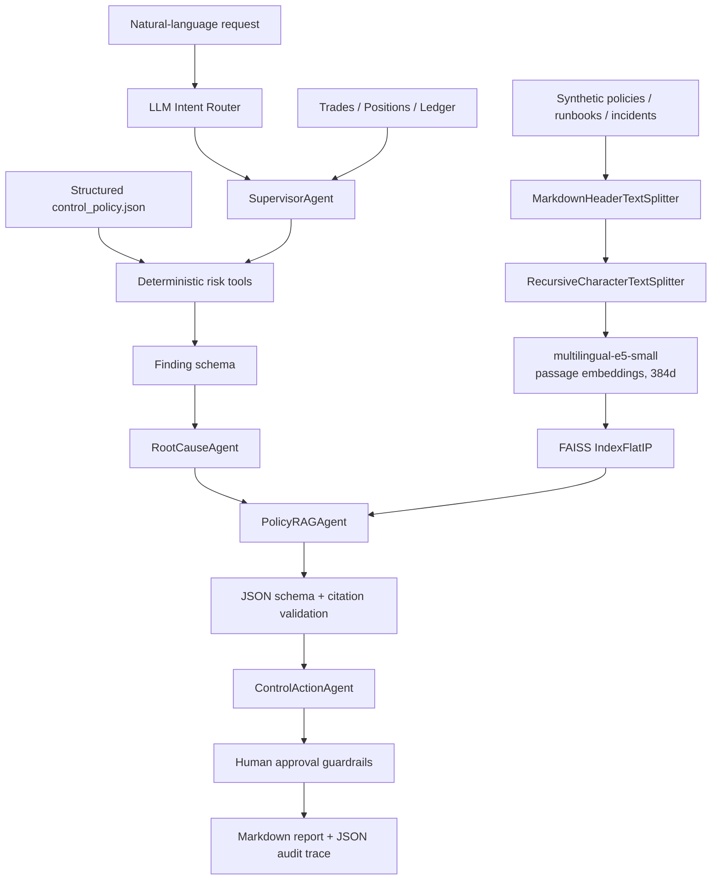

# Agentic Trading Risk Control Copilot V3：RAG 面试讲解

> 本项目中的政策、runbook、历史事件和交易数据全部是 synthetic demo data，不代表 Bitget 或任何真实交易所的内部制度。

## 一句话介绍

我做的是一个面向交易风控运营的 agentic copilot：它先用 LLM 将自然语言请求路由到受限 workflow，再由 deterministic tools 检测交易、库存、手续费和清算对账风险；V3 新增 Policy RAG，从政策、处置手册和历史事件中检索证据，为每个 finding 生成带 citation 的解释和调查建议，同时把交易、对冲、改限额等高影响动作保留在 human approval 之后。

## V3 技术流程



## 离线索引如何构建

1. `knowledge_base/` 中有 policy、runbook、incident 三类文档，每份文档都带 `document_id`、`risk_domain`、`version`、`effective_from`、`status`、`jurisdiction`、`owner` 和 `synthetic` 元数据。
2. `MarkdownHeaderTextSplitter` 先按 Markdown 标题保留语义完整的 section。
3. `RecursiveCharacterTextSplitter` 再将过长 section 切成约 900 characters、120 characters overlap 的 chunk。
4. 每个 chunk 获得确定性 ID，例如 `POL-INV-001:004`，并继承文档元数据。
5. 使用 `intfloat/multilingual-e5-small` 本地模型生成 384-dimensional embedding。文档输入添加 `passage:` 前缀，查询添加 `query:` 前缀，并对向量做 L2 normalization。
6. 使用 FAISS `IndexFlatIP` 建立 exact vector index。向量归一化后，inner product 等价于 cosine similarity。
7. 二进制索引、chunk metadata sidecar 和 manifest 写入 `data/rag_index/`。manifest 记录 embedding model、维度、分块参数、文档/分块数量和 source SHA-256，便于审计与重建。

## 在线检索与生成如何工作

对于一个 `inventory_limit` finding，系统不会只把“库存超限”丢给 LLM。它构造包含 finding ID、risk domain、deterministic evidence、初始 hypothesis 和 control rule ID 的查询。

检索阶段先做 dense retrieval，再进行 application-side metadata filtering：

- `risk_domain=inventory_limit`
- `status=active`
- `effective_from <= today`
- `jurisdiction in {requested, global}`
- `score >= 0.70`
- `top_k=4`

检索结果将 chunk ID、document ID、title、section、version 和文本作为 untrusted context 发给 LLM。LLM 必须输出固定 JSON：

```json
{
  "grounded": true,
  "answer": "...",
  "root_cause_hypotheses": ["..."],
  "recommended_next_steps": ["..."],
  "citation_chunk_ids": ["POL-INV-001:004"]
}
```

程序随后验证：keys 必须完全匹配、字段类型和数量合法、`grounded=true` 时至少有一个 citation、所有 citation 必须属于当前 retrieval set。模型如果生成未检索的 ID，系统直接抛出 `RAGGenerationError`，而不是把答案展示给用户。若检索结果没有真正回答问题，模型必须输出 `grounded=false` 且不把引用冒充为支持证据；若没有 chunk 达到阈值，则直接 abstain，不调用生成模型。Similarity threshold 只是召回候选信号，不能单独证明知识库存在答案。

## 为什么阈值不放在 RAG 文档里执行

自然语言政策适合解释“为什么报警、应该查什么、如何升级”，但不适合充当可执行配置。文档可能过期、被错误召回或被 prompt injection 污染。因此：

- `control_policy.json` 是数值阈值和 action type 的 source of truth；
- deterministic tools 负责计算与报警；
- RAG 只提供解释、调查证据和 runbook；
- ControlActionAgent 只产生 proposal；
- guardrail 决定是否进入 ops queue 或 human approval queue。

这个边界比“让 LLM 读政策以后自己决定是否交易”更适合风险和合规场景。

## 当前真实验证结果

- Knowledge documents：13
- Chunks：62
- Embedding dimension：384
- Vector index：FAISS `IndexFlatIP`
- Retrieval benchmark：20 个中英双语 case，其中 16 个 answerable、4 个应拒答
- Recall@4：1.0000
- Hit Rate@4：1.0000
- MRR：0.8958
- Metadata-filter Abstention Accuracy：1.0000
- Unit/integration tests：14/14 passed

这些结果来自小规模 synthetic benchmark，适合做 regression test，不能声称代表线上生产质量。其中拒答指标只测带 domain label 的 metadata filter，不是端到端生成拒答准确率。扩大语料后还需要独立 test set、hard negatives、reranker、人工 relevance judgement 和线上 A/B test。

## 高频面试问题与回答

### 1. 为什么选择 multilingual-e5-small？

语料和用户查询可能中英混合，E5 是面向 retrieval 训练的 multilingual embedding model。small 版本本地推理成本低，适合 MVP；它的 384 维向量也能降低内存和索引开销。项目遵循 model card 的 `query:` / `passage:` 前缀和 normalization 要求。

### 2. 为什么用 FAISS，不用 Milvus、pgvector 或 Weaviate？

这是 62 个 chunk 的单机 MVP，FAISS `IndexFlatIP` exact search 简单、可复现、没有额外服务运维。若进入多租户生产环境并需要在线更新、ACL filter、replication、high availability 和 distributed scaling，我会迁移到 Milvus 或 pgvector，而不是硬把 FAISS 扩成服务。

### 3. 为什么不是直接对整篇文档 embedding？

整篇文档会混合多个 topic，导致 embedding 表示过于平均，而且会把大量无关内容送入 LLM。先按 heading 保留 section，再递归切分，可以提高 retrieval precision，同时 citation 能定位到具体条款而非整篇文档。

### 4. overlap 有什么作用？

它减少结论或定义恰好跨切分边界时的信息丢失。overlap 过大则会增加重复结果、token cost 和 index size，所以这里采用 120/900 的小比例，并通过 retrieval benchmark 调参。

### 5. 如何防 hallucinated citation？

LLM 只返回 `citation_chunk_ids`，source title 和 metadata 不相信模型生成，而是由程序根据当前 retrieved chunks 回填。引用 ID 不在当前 retrieval set 中就拒绝整个输出。

### 6. 如何处理 outdated policy？

chunk 带 version、effective date 和 status。检索必须在生成前过滤 inactive 或尚未生效的文档；manifest 记录 source hash。生产中还应接 policy management service，保证更新事件触发 re-index，并保留 index/model/prompt version 以便 replay。

### 7. 历史事件能否证明当前 root cause？

不能。incident retrieval 只提供 analogous failure mode。prompt 明确要求把它写成 hypothesis，报告也标为“not confirmed”；analyst 仍需检查当前订单、仓位、账户配置和事件时间线。

### 8. 如何评估 RAG？

分层评估：retrieval 用 Recall@K、MRR、Hit Rate 和 no-answer abstention；generation 用 faithfulness、answer relevance、citation precision/coverage 和人工审核；system 层看 latency、cost、case-resolution time、analyst acceptance rate，以及是否发生 policy/permission violation。离线通过后再做 shadow traffic 和 A/B test。

### 9. 这算真正的 agent 吗？

它是 bounded workflow agent，而不是 unrestricted autonomous agent。它有 natural-language routing、specialist agents、tool use、state passing、RAG、structured outputs、guardrails 和 audit trace；但没有开放式 observe-plan-act-replan loop。对交易风控而言，bounded capability 是有意的安全设计，不是遗漏。

### 10. 与直接调用通用聊天模型相比有什么优势？

通用模型的计算、证据、权限和输出格式依赖临时 prompt。这个项目把风险计算固定为 deterministic tools，把知识来源限制在可追踪文档，把引用和 JSON schema 做程序验证，把高风险动作放进 human approval，并能用固定 benchmark 做 regression test。因此它更可复现、更可审计，也更容易接 API、queue、monitoring 和权限系统。

## 下一步生产化路线

1. 接入真实且授权的 policy repository，并实现 document-level ACL、tenant 和 region filters。
2. 增加 BM25 + dense hybrid retrieval 和 cross-encoder reranker。
3. 用真实 analyst query 构建训练/评测数据，加入 hard-negative mining。
4. 暴露 FastAPI/gRPC 服务，加入 Docker、CI/CD、Prometheus latency/token/cost metrics。
5. 将 model、prompt、index、policy 和 tool version 写入 tracing，并实现 canary release 和 rollback。
6. 对 PII 做 redaction，对检索语料做 prompt-injection scanning，并进行 jailbreak/red-team evaluation。
7. 在线实验比较 analyst resolution time、recommendation acceptance、false escalation rate 和 cost per resolved case。
